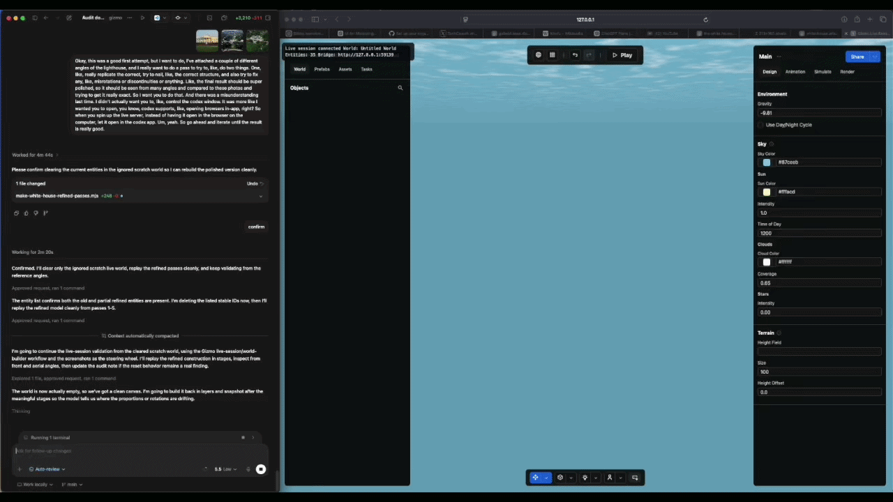

# Gizmo

Gizmo is an open-source toolkit for building, editing, and automating browser
3D worlds. It combines a Three.js/Rapier runtime engine, a local editor-oriented
automation layer, a command-line tool, and an MCP server that lets coding agents
inspect and modify worlds through structured commands.

<p align="center">
  <a href="./docs/assets/world-building-demo.mp4">
    
  </a>
</p>

Gizmo lets coding agents inspect, edit, and visually validate browser 3D worlds
through the CLI and MCP.

The repo is a public npm workspace for the packages published under the
`@gizmo3d` scope:

- [`@gizmo3d/engine`](./engine/README.md): the browser/runtime engine, editor
  APIs, world serialization, automation commands, and browser runtime bundles.
- [`@gizmo3d/cli`](./cli/README.md): the `gizmo` command for creating worlds,
  starting live browser sessions, running automation commands, and capturing
  screenshots.
- [`@gizmo3d/mcp`](./mcp/README.md): an MCP server that exposes Gizmo automation
  commands and resources to MCP-compatible clients.

## Quick Start

Install the CLI:

```bash
npm install -g @gizmo3d/cli
```

For coding agents, install the portable Gizmo skill:

```bash
npx skills add generalholography/gizmo -g -y
```

Then ask your agent to use Gizmo in an empty project folder. The skill teaches
the agent to run `gizmo start --no-open --port 0`, immediately share the printed
local browser URL so you can watch if you want, keep working without waiting for
you to open it, make the first edits quickly, and capture screenshots once a
browser is attached.

For manual CLI use:

```bash
mkdir my-world
cd ./my-world
gizmo start
```

In an empty folder, `gizmo start` creates `world.json`, starts a local live
session, opens a browser, and prints MCP connection details. Follow-up commands
reuse the active session:

```bash
gizmo resource world-state-summary
gizmo call add-entity --params '{"archetypeOrDef":"cube"}'
gizmo snapshot
```

Manual live-editor saves write back to `world.json`. Screenshots and live-editor
exports are written under `.gizmo/runs/<run-id>/artifacts/`.

When you are done, stop the local live server:

```bash
gizmo stop
```

The installed CLI also includes agent-readable reference docs:

```bash
npx -y @gizmo3d/cli@latest skills --print gizmo
npx -y @gizmo3d/cli@latest docs workflow
```

For local repo development, use the workspace scripts instead:

```bash
npm install
npm run build
npm test
npm run validate
```

## What You Can Build

Gizmo is intended for:

- Interactive browser scenes and small games.
- Agent-assisted world creation and editing.
- Local automation workflows that need structured world state, screenshots, and
  repeatable commands.
- Tools that embed a 3D runtime, editor surface, or world serialization layer.

## Why Gizmo?

- Local-first workflow: create a world in an empty folder with one command.
- Agent-friendly surface: coding agents can inspect state, make structured
  changes, move the camera, and capture screenshots through CLI or MCP.
- Shared automation model: the CLI, MCP server, live browser session, and engine
  automation APIs use the same command/resource definitions.
- Browser runtime included: embed the engine directly or use the CLI to serve a
  live editor session while iterating.

Worlds are serializable scene/simulation definitions. Entities are composed from
components. Behavior is modeled with rules, triggers, conditions, actions, and
stores. Automation commands mutate worlds through the same editor command path
used by live sessions, while automation resources expose read-only views of the
current world.

## Documentation

- [Documentation index](./docs/index.md)
- [Getting started](./docs/getting-started.md)
- [Concepts](./docs/concepts.md)
- [Install guide](./docs/install.md)
- [Architecture overview](./docs/architecture.md)
- [Examples](./docs/examples.md)
- [Engine overview](./docs/engine/overview.md)
- [CLI overview](./docs/cli/overview.md)
- [MCP overview](./docs/mcp/overview.md)
- [Agent workflows](./docs/agents/overview.md)
- [Gizmo Agent Skills](./docs/agents/skills.md)
- [Generated reference](./docs/reference/index.md)
- [Security model](./SECURITY.md)
- [Contributing](./CONTRIBUTING.md)

## Packages

### `@gizmo3d/engine`

Use the engine when you want to embed Gizmo in a browser app or build directly
against the runtime/editor APIs.

```ts
import { EngineMode, startEngine } from '@gizmo3d/engine';

const canvas = document.querySelector('canvas');
const engine = startEngine(canvas!, { mode: EngineMode.EDITOR });
```

See [engine/README.md](./engine/README.md) and
[docs/engine/overview.md](./docs/engine/overview.md).

### `@gizmo3d/cli`

Use the CLI for world workspaces, live sessions, MCP setup, automation commands,
resources, camera control, and screenshots.

```bash
mkdir my-world
cd ./my-world
gizmo start --no-open --port 0
gizmo call add-entity --params '{"archetypeOrDef":"cube"}'
```

See [cli/README.md](./cli/README.md) and
[docs/cli/overview.md](./docs/cli/overview.md).

### `@gizmo3d/mcp`

Use the MCP package when you want to run or embed the Gizmo MCP server directly.
Most users can start with `gizmo mcp`; library users can import the server
factory.

See [mcp/README.md](./mcp/README.md) and
[docs/mcp/overview.md](./docs/mcp/overview.md).

## Local Development

This repo uses npm workspaces:

```text
engine/  @gizmo3d/engine
cli/     @gizmo3d/cli
mcp/     @gizmo3d/mcp
```

Common commands:

```bash
npm install
npm run build
npm test
npm run validate
npm run pack:dry-run
```

Package-specific commands:

```bash
npm run test --workspace=engine
npm run build --workspace=mcp
npm run validate --workspace=cli
```

## Publishing And Releases

npm is the public distribution source for Gizmo. Tagged releases publish
`@gizmo3d/engine`, `@gizmo3d/cli`, and `@gizmo3d/mcp` from
[.github/workflows/release.yml](./.github/workflows/release.yml) using npm
trusted publishing and provenance.

The workflow validates the repo, builds publishable package contents, dry-runs
package contents, publishes the three public workspaces to npm, and creates a
GitHub Release for the version tag. GitHub Releases are the changelog and tag
record; package contents are consumed from npm.

Applications that need the engine browser runtime should install
`@gizmo3d/engine` and copy or serve the selected runtime version from:

```text
node_modules/@gizmo3d/engine/dist/browser/<engine-version>/
```

## Security

Gizmo automation is designed for trusted local workspaces. JavaScript world files
and persisted runtime module factories can execute code. Do not run `gizmo`,
the MCP server, or live sessions against untrusted repositories or world files.

See [SECURITY.md](./SECURITY.md) before exposing live sessions beyond loopback or
loading worlds from sources you do not control.

## Contributing

Issues and pull requests are welcome while the public project is taking shape.
Start with [CONTRIBUTING.md](./CONTRIBUTING.md), and include focused tests or
validation output with changes that affect runtime, CLI, MCP, or docs behavior.

## License

Gizmo is licensed under the [Apache License 2.0](./LICENSE).
